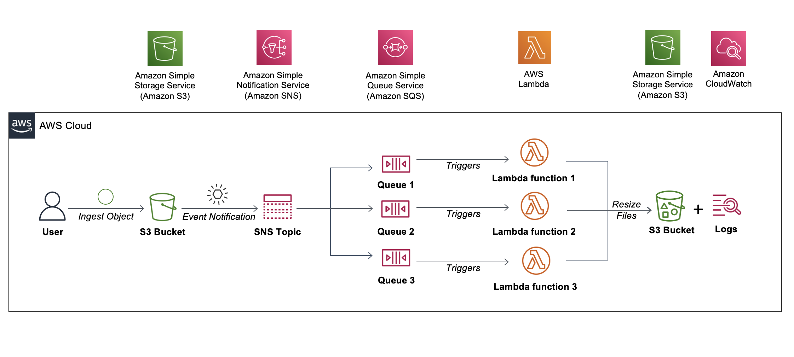

# Serverless AWS Architecture with SNS, SQS, and Lambda

## Project Overview

This project implements a serverless architecture using AWS services, leveraging Simple Notification Service (SNS), Simple Queue Service (SQS), and AWS Lambda. The architecture is designed to facilitate asynchronous communication and efficient event processing in a scalable and cost-effective manner.

# Image Processing Workflow Overview

## User Uploads Image to S3 Bucket:

A user initiates the workflow by uploading an image file to an Amazon S3 bucket. This action triggers an event notification within the S3 bucket.

## S3 Event Notification to SNS Topic:

Upon uploading the image file, an S3 event notification is automatically sent to an Amazon SNS (Simple Notification Service) topic. This topic acts as a central hub for handling notifications.

## SNS Distributes Notifications to SQS Queues:

The SNS topic is configured to distribute notifications to three separate Amazon SQS (Simple Queue Service) queues. Each SQS queue is subscribed to the SNS topic, allowing it to receive relevant notifications.

## Lambda Functions Triggered by SQS Queues:

Each SQS queue triggers a specific AWS Lambda function responsible for image processing. There are three Lambda functions, each designed to process images in a different format.

## Lambda Functions Resize and Save to S3 Bucket:

The Lambda functions receive notifications from the SQS queues and proceed to resize the uploaded images in their respective formats. The resulting resized images are then saved to a different folder within the same S3 bucket.

## Validation of Processed Images:

After the Lambda functions have executed, you can validate the processed images in the designated folders within the S3 bucket. These folders should contain the resized copies of the originally uploaded images.

## Logs in Amazon CloudWatch:

Additionally, logs generated by the Lambda functions during image processing are available in Amazon CloudWatch. You can review these logs for insights into the execution and any potential issues encountered during the image processing workflow.

